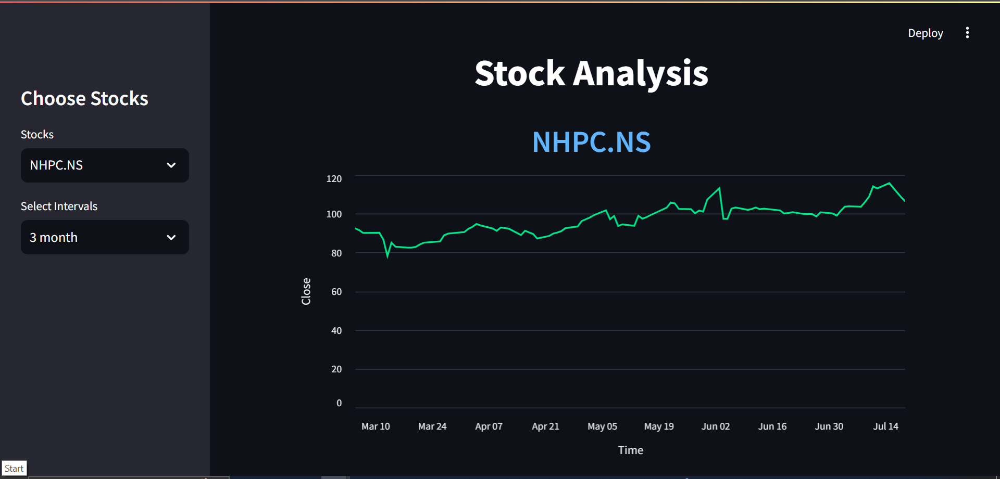
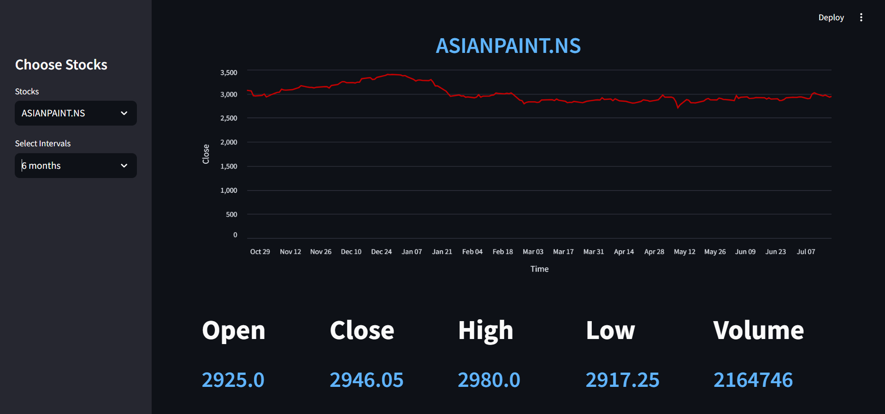
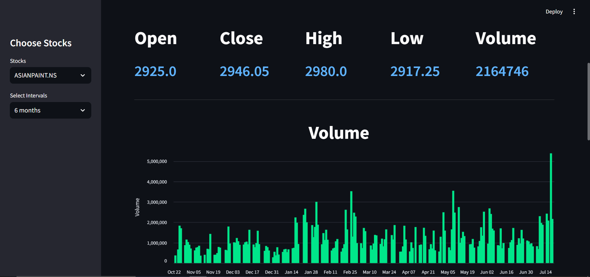
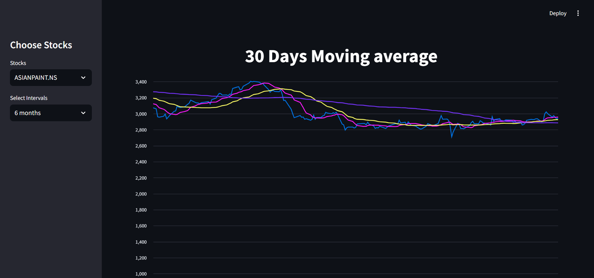

# Stock Analysis Web Application

This project is a web application for analyzing stock data using the Streamlit library in Python. The application provides features such as selecting stocks, viewing line charts, current stock information (low, high, open, close, volume), volume bar graphs, and moving averages for different intervals.

## Link

https://stock-price-analysis-vhawjkrpdyvzmnvdfewmht.streamlit.app/

## Features

- **Select Stock**: Choose a stock ticker symbol to view its data.
- **Select Interval**: Choose an interval (1 week, 1 month, 3 months, 6 months, 1 year, 3 years) for the stock data.
- **Stock Information**: Display current low, high, open, close, and volume.
- **Line Chart**: Visualize the stock price over time.
- **Volume Bar Graph**: Display the stock's trading volume.
- **Moving Averages**: Calculate and display moving averages for 10, 30, and 100 days.

## Installation

1. Clone the repository:

    ```bash
    git clone https://github.com/yourusername/stock-price-analysis.git
    cd stock-analysis-app
    ```

2. Create and activate a virtual environment (optional but recommended):

    ```bash
    python -m venv env
    source env/bin/activate  # On Windows use `env\Scripts\activate`
    ```

3. Install the required packages:

    ```bash
    pip install -r requirements.txt
    ```

## Usage

1. Run the Streamlit application:

    ```bash
    streamlit run app.py
    ```

2. Open your web browser and go to `http://localhost:8501`.

3. Use the sidebar to enter a stock ticker symbol and select an interval to view the stock's data and analysis.

## Example

Here is an example of what the application might look like:













## Dependencies

- `streamlit`
- `pandas`
- `yfinance`
- `matplotlib`
- `seaborn`

## File Structure

```plaintext
stock-analysis-app/
│
├── app.py
├── helper.py
├── preprocessor.py
├── requirements.txt
├── README.md
└── screenshots/
    └── screenshot.png
